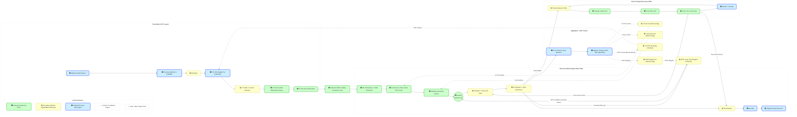

```mermaid
---
config:
  theme: base
---
%%{init: {'theme': 'base', 'themeVariables': { 'primaryColor': '#ffffff', 'primaryTextColor': '#333', 'primaryBorderColor': '#ccc', 'lineColor': '#555', 'fontFamily': 'inter, sans-serif'}}}%%
flowchart LR
    %% =========================
    %% Circuit Domain Color Key (Top Right)
    %% =========================
    subgraph Legend ["Circuit Domains"]
        direction TB
        AnalogK["🟩 Analog (Continuous-time)"]:::analogNode
        BoundaryK["🟨 Boundary (Mixed-Signal/Mixed-Domain)"]:::boundaryNode
        DigitalK["🟦 Digital (Discrete-time/Logic)"]:::digitalNode
        ControlSignalK["- - - Control / Feedback Signal"]
        DataSignalK["── Data / Main Signal Path"]
    end

    %% Define Node Classes (CSS Styles)
    classDef analogNode fill:#ccffcc,stroke:#00aa00,stroke-width:2px,rx:8,ry:8;
    classDef boundaryNode fill:#ffffcc,stroke:#aaaa00,stroke-width:2px,rx:8,ry:8,stroke-dasharray: 5 5;
    classDef digitalNode fill:#cceeff,stroke:#0000ff,stroke-width:2px,rx:8,ry:8;

    %% =========================
    %% TRANSMITTER (TX)
    %% =========================
    subgraph TX["Transmitter (PHY Layer)"]
        direction LR
        TX_DigitalIn["🟦 Digital Parallel Data In"]:::digitalNode --> TX_Encoder["🟦 Encoder (8b/10b or 64b/66b)"]:::digitalNode
        TX_Encoder --> TX_Serializer["🟨 Serializer"]:::boundaryNode
        TX_Serializer --> TX_FFE["🟦 TX FFE (Digital Pre-emphasis)"]:::digitalNode
        TX_FFE --> TX_DAC["🟨 TX DAC / Current Steering"]:::boundaryNode
        TX_DAC --> TX_Driver["🟩 TX Driver (CML differential output)"]:::analogNode
        TX_Driver --> TX_Termination["🟩 TX On-Chip Termination"]:::analogNode
    end

    TX_Termination --> Channel["🟩 Channel (PCB, Cables, Connector loss)"]:::analogNode

    %% =========================
    %% RECEIVER (RX DATA PATH)
    %% =========================
    subgraph RX["Receiver (Mixed-Signal Data Path)"]
        direction LR
        RX_Termination["🟩 RX Termination + ESD Protection"]:::analogNode --> RX_CTLE["🟩 Continuous-Time Linear Eq (CTLE)"]:::analogNode
        RX_CTLE --> RX_VGA["🟩 Variable Gain Amp (VGA)"]:::analogNode
        
        %% Summing node is explicitly called out here
        RX_VGA --> RX_Summer(("🟩 Analog<br>Summer (Σ)")):::analogNode
        
        RX_Summer --> RX_Sampler["🟨 Sampler / Track-and-Hold"]:::boundaryNode
        RX_Sampler --> RX_Comparator["🟨 Comparator / Slicer (Decision)"]:::boundaryNode
        
        RX_Comparator --> RX_Deserializer["🟨 Deserializer"]:::boundaryNode
        RX_Deserializer --> RX_Decoder["🟦 Decoder"]:::digitalNode
        RX_Decoder --> RX_DigitalOut["🟦 Digital Parallel Data Out"]:::digitalNode
    end

    Channel --> RX_Termination

    %% =========================
    %% DFE FEEDBACK LOOP (Mixed-Domain)
    %% =========================
    RX_Comparator -- "Decided Bits (yk)" --> DFE["🟨 DFE Logic (Tap Weights & History)"]:::boundaryNode
    DFE -- "DFE Feedback (Analog Value)" --> RX_Summer

    %% =========================
    %% CDR LOOP (Analog & Digital Components)
    %% =========================
    subgraph CDR["Clock & Data Recovery (CDR)"]
        direction LR
        CDR_PD["🟨 Phase Detector (PD)"]:::boundaryNode --> CDR_CP["🟩 Charge Pump (CP)"]:::analogNode
        CDR_CP --> CDR_LF["🟩 Loop Filter (LF)"]:::analogNode
        CDR_LF --> CDR_VCO["🟩 VCO / PLL Clock Gen"]:::analogNode
        CDR_VCO --> CDR_Divider["🟦 Divider / Counter"]:::digitalNode
        CDR_Divider --> CDR_PD
    end
    
    RX_Comparator -- "Data Edges" --> CDR_PD
    CDR_VCO -- "Recovered Clock" --> RX_Sampler
    CDR_VCO -- "Recovered Clock" --> RX_Deserializer

    %% =========================
    %% ADAPTATION LOOP (Digital DSP, Mixed-Signal Control)
    %% =========================
    subgraph Adapt["Adaptation / DSP Control"]
        direction LR
        Adapt_ErrorDetector["🟦 Error Detector (Eye Monitor)"]:::digitalNode --> Adapt_Engine["🟦 Adaptive Engine (LMS, DSP Algorithm)"]:::digitalNode
    end
    
    RX_Comparator --> Adapt_ErrorDetector
    
    %% Use dashed lines for adaptation control signals (Digital logic interfacing with Analog)
    Adapt_Engine -. "CTLE Control" .-> Adapt_CTLECtrl["🟨 CTLE Ctrl (DAC/Config)"]:::boundaryNode -. "CTLE Setting" .-> RX_CTLE
    Adapt_Engine -. "VGA Control" .-> Adapt_VGACtrl["🟨 VGA Gain Ctrl (DAC/Config)"]:::boundaryNode -. "VGA Setting" .-> RX_VGA
    Adapt_Engine -. "DFE Weights" .-> Adapt_DFECtrl["🟨 DFE Weight Ctrl (DAC/Config)"]:::boundaryNode -. "DFE Weights" .-> DFE
    Adapt_Engine -. "FFE Control (Backchannel)" .-> Adapt_FFECtrl["🟨 TX FFE Ctrl (Reg interface)"]:::boundaryNode -. "FFE Setting" .-> TX_FFE
```