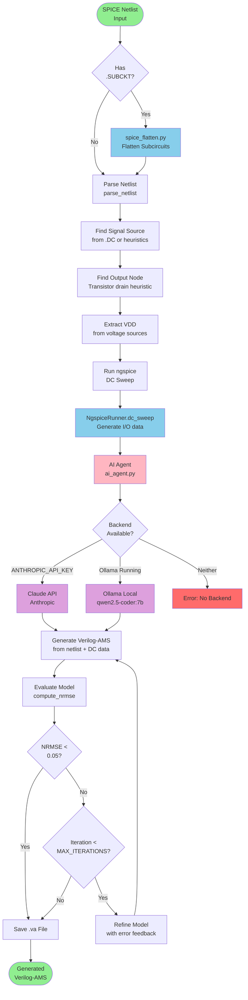
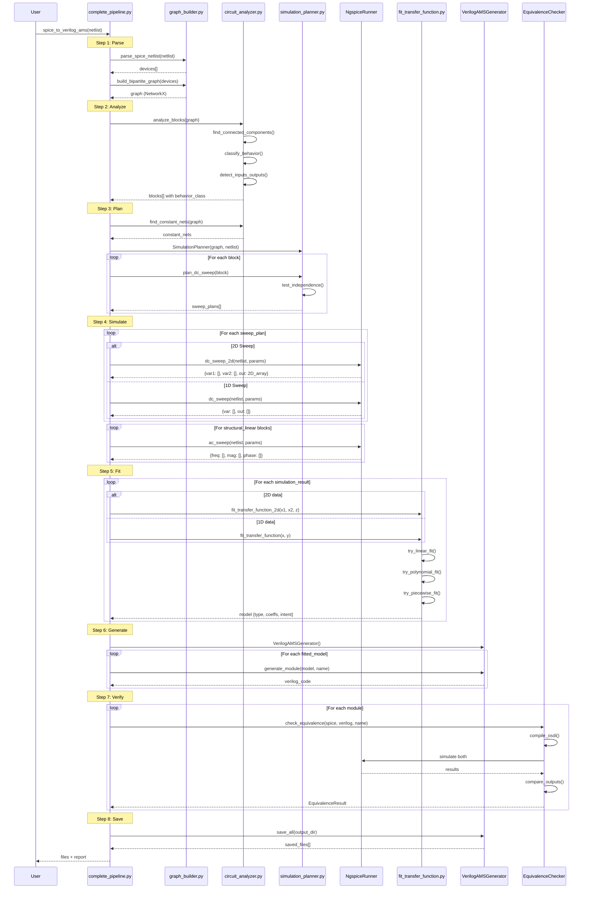
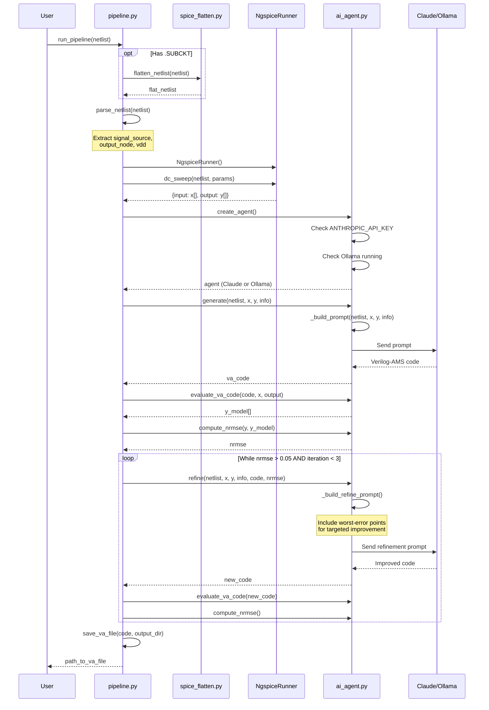
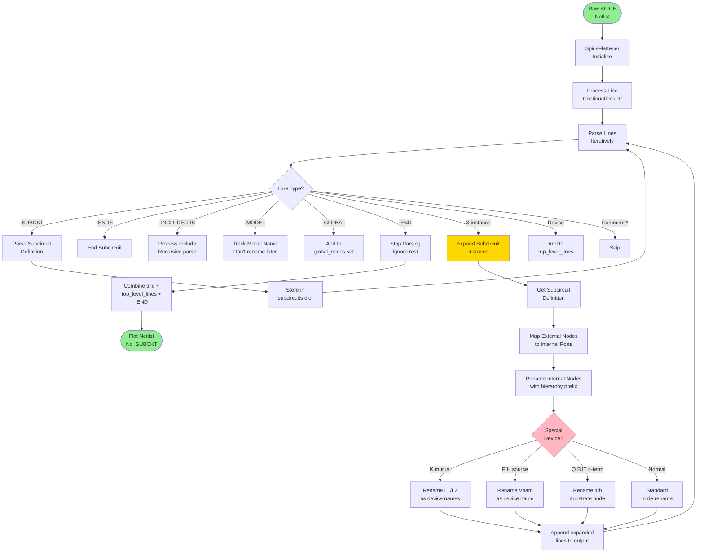
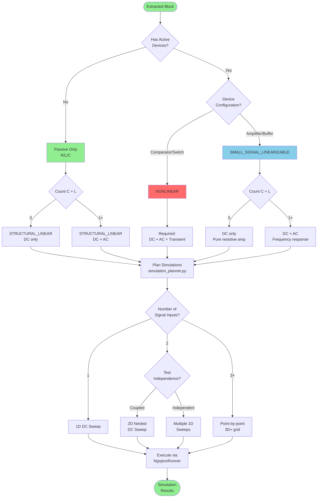
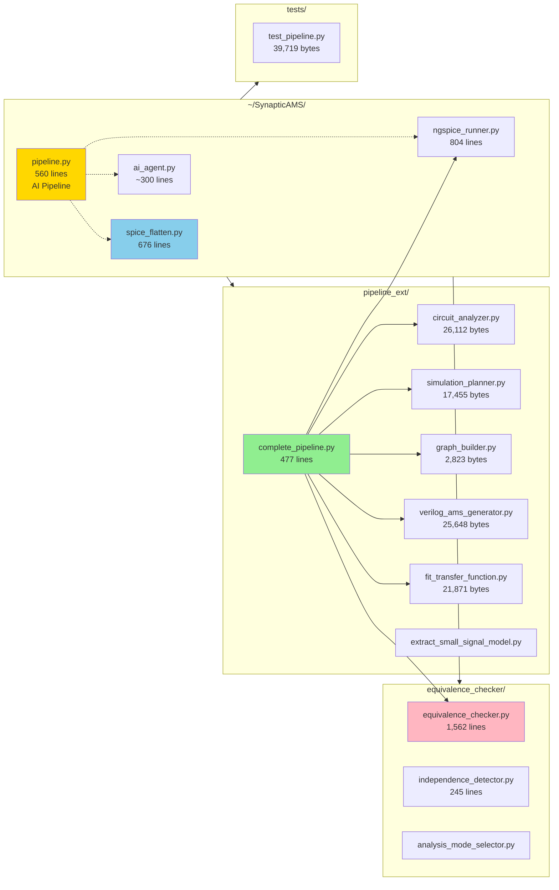
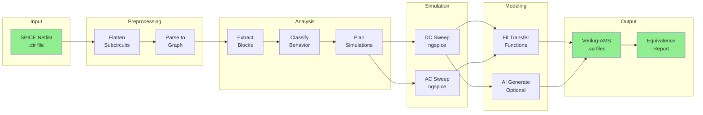
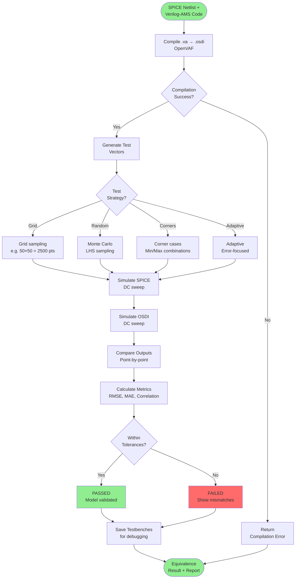
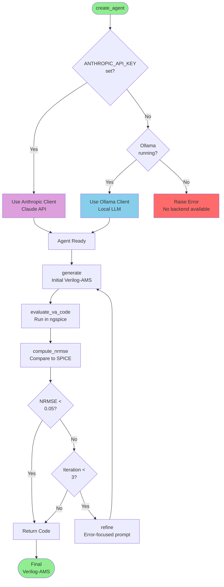

# SynapticAMS AI-Integration Branch Architecture

## Overview

The ai-integration branch contains **TWO parallel pipelines** for SPICE → Verilog-AMS conversion:

1. **AI Pipeline** (`pipeline.py`) - Uses LLM (Claude/Ollama) for code generation
2. **Programmatic Pipeline** (`pipeline_ext/complete_pipeline.py`) - Uses algorithmic model fitting

---

## 1. AI Pipeline Flow (pipeline.py)



---

## 2. Programmatic Pipeline Flow (pipeline_ext/complete_pipeline.py)

```mermaid
flowchart TD
    Start([SPICE Netlist<br/>Input]) --> Step1

    subgraph Step1["[1/8] Parse SPICE Netlist"]
        Parse[parse_spice_netlist<br/>graph_builder.py]
        Parse --> BuildGraph[build_bipartite_graph<br/>Devices ↔ Nets]
    end

    Step1 --> Step2

    subgraph Step2["[2/8] Analyze Structure"]
        AnalyzeBlocks[analyze_blocks<br/>circuit_analyzer.py]
        AnalyzeBlocks --> Classify{Classify<br/>Behavior}
        Classify --> Structural[STRUCTURAL_LINEAR<br/>Passive R/L/C only]
        Classify --> SmallSignal[SMALL_SIGNAL_LINEARIZABLE<br/>Amplifiers, buffers]
        Classify --> Nonlinear[NONLINEAR<br/>Comparators, switches]
    end

    Step2 --> Step3

    subgraph Step3["[3/8] Plan Simulations"]
        CreatePlanner[SimulationPlanner<br/>simulation_planner.py]
        CreatePlanner --> FindConstants[find_constant_nets]
        FindConstants --> PlanDC[plan_dc_sweep<br/>1D or 2D based on inputs]
        PlanDC --> IndependenceTest{Test Input<br/>Independence?}
        IndependenceTest -->|Coupled| Use2D[Plan 2D Sweep]
        IndependenceTest -->|Independent| Use1D[Plan 1D Sweeps]
    end

    Step3 --> Step4

    subgraph Step4["[4/8] Run ngspice"]
        RunSweeps[NgspiceRunner]
        RunSweeps --> DC1D[dc_sweep<br/>1D analysis]
        RunSweeps --> DC2D[dc_sweep_2d<br/>2D nested sweep]
        RunSweeps --> ACSweep[ac_sweep<br/>Frequency response]
        RunSweeps --> ExtractAC[extract_ac_params<br/>gm, gds, Cgs, etc.]
    end

    Step4 --> Step5

    subgraph Step5["[5/8] Fit Models"]
        FitModels[fit_transfer_function.py]
        FitModels --> Fit1D[1D: Linear/Poly/Piecewise]
        FitModels --> Fit2D[2D: Bilinear/Surface fit]
        FitModels --> FitAC[AC: Transfer function H(s)]
        FitModels --> FitSS[Small-signal: gm, gds model]
    end

    Step5 --> Step6

    subgraph Step6["[6/8] Generate Verilog-AMS"]
        VerilogGen[VerilogAMSGenerator<br/>verilog_ams_generator.py]
        VerilogGen --> GenLinear[Generate linear model<br/>V(out) <+ gain * V(in)]
        VerilogGen --> GenNonlinear[Generate nonlinear<br/>Piecewise/polynomial]
        VerilogGen --> GenSS[Generate small-signal<br/>with AC params]
    end

    Step6 --> Step7

    subgraph Step7["[7/8] Equivalence Checking"]
        EquivCheck[OSDIEquivalenceChecker<br/>equivalence_checker_osdi.py]
        EquivCheck --> CompileOSDI[Compile .va → .osdi<br/>OpenVAF]
        CompileOSDI --> SimBoth[Simulate SPICE +<br/>OSDI in ngspice]
        SimBoth --> Compare[Compare outputs<br/>abs_tol, rel_tol]
        Compare --> Report[Pass/Fail + metrics]
    end

    Step7 --> Step8

    subgraph Step8["[8/8] Save Files"]
        SaveAll[generator.save_all<br/>Write .va files]
    end

    Step8 --> End([Generated<br/>Verilog-AMS Modules<br/>+ Equivalence Report])

    style Start fill:#90EE90
    style End fill:#90EE90
    style EquivCheck fill:#FFB6C1
    style VerilogGen fill:#FFD700
    style RunSweeps fill:#87CEEB
    style FitModels fill:#DDA0DD
```

---

## 3. Module Interaction Sequence (Programmatic Pipeline)



---

## 4. AI Pipeline Sequence (pipeline.py)



---

## 5. SPICE Flattening Architecture (spice_flatten.py)



---

## 6. Circuit Classification & Analysis Mode Selection



---

## 7. Complete File Structure (ai-integration branch)



---

## 8. Data Flow Overview



---

## 9. Equivalence Checking Flow



---

## 10. AI Agent Backend Selection



---

## Summary

The ai-integration branch provides:

1. **AI Pipeline** (`pipeline.py`)
   - LLM-based code generation
   - Iterative refinement with error feedback
   - Supports Claude API and Ollama local LLM

2. **Programmatic Pipeline** (`pipeline_ext/complete_pipeline.py`)
   - 8-step algorithmic pipeline
   - Automatic circuit classification
   - Model fitting (linear, polynomial, piecewise)
   - OSDI-based equivalence checking

3. **Shared Infrastructure**
   - `spice_flatten.py` - SPICE 3F5 compliant netlist flattening
   - `ngspice_runner.py` - DC/AC sweep execution
   - `equivalence_checker/` - Model validation

Both pipelines produce validated Verilog-AMS behavioral models from SPICE netlists.
