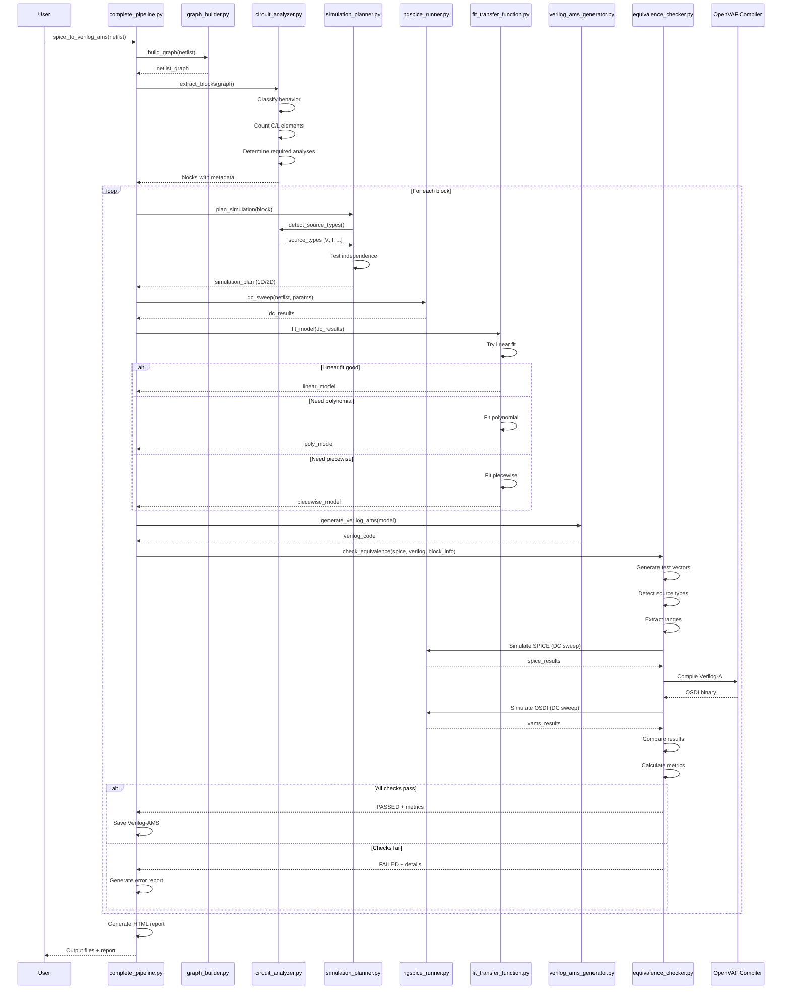
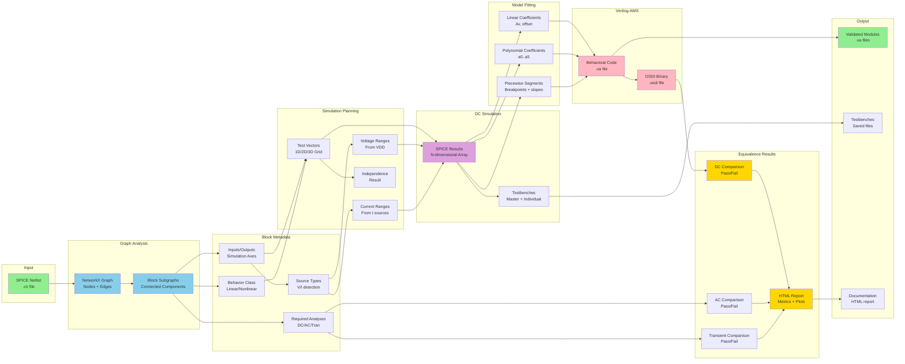
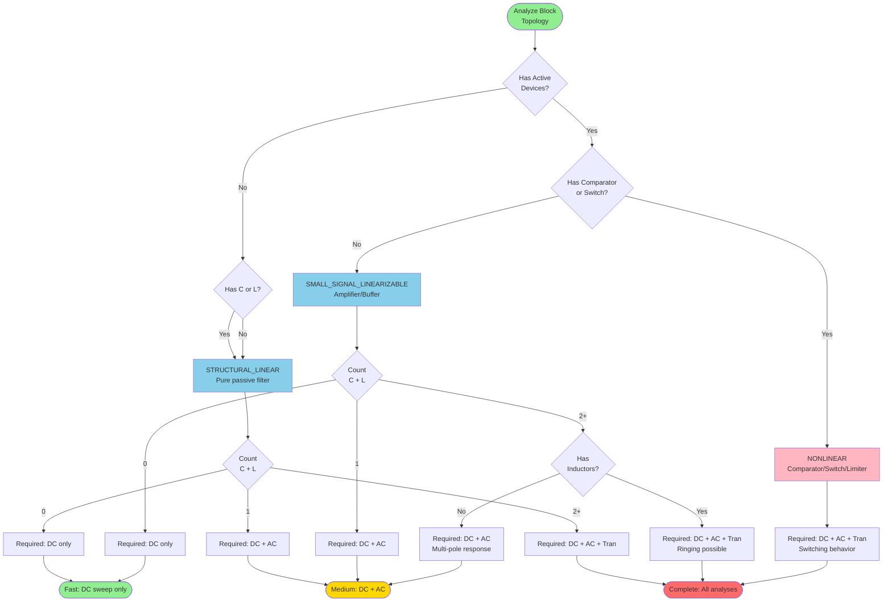
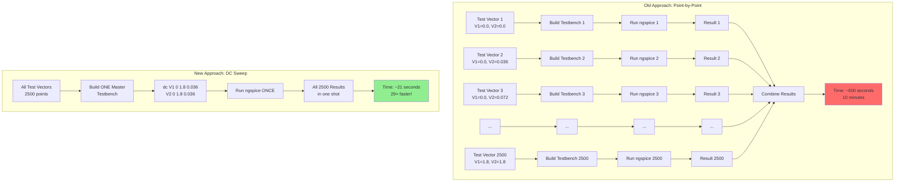

# SynapticAMS Pipeline Architecture

## Complete Pipeline Flow

```mermaid
flowchart TD
    Start([SPICE Netlist Input]) --> GraphBuilder[Graph Builder<br/>graph_builder.py]

    GraphBuilder --> CircuitAnalyzer[Circuit Analyzer<br/>circuit_analyzer.py]

    CircuitAnalyzer --> BlockExtraction{Extract Blocks}
    BlockExtraction --> ClassifyBehavior[Classify Behavior<br/>STRUCTURAL_LINEAR<br/>SMALL_SIGNAL_LINEARIZABLE<br/>NONLINEAR]

    ClassifyBehavior --> TopologyAnalysis[Topology Analysis<br/>Count C/L Elements<br/>Detect Active Devices]

    TopologyAnalysis --> DetermineAnalyses[Determine Required Analyses<br/>DC / DC+AC / DC+AC+Tran]

    DetermineAnalyses --> SimPlanner[Simulation Planner<br/>simulation_planner.py]

    SimPlanner --> IndependenceCheck{Test Input<br/>Independence}

    IndependenceCheck -->|Coupled| Use2D[Use 2D DC Sweep]
    IndependenceCheck -->|Independent| Use1D[Use 1D DC Sweeps]

    Use2D --> DCSimulation[DC Simulation<br/>ngspice_runner.py]
    Use1D --> DCSimulation

    DCSimulation --> DCResults[DC Sweep Results<br/>2D or 1D Arrays]

    DCResults --> ModelFitting[Model Fitting<br/>fit_transfer_function_dc_sweep.py]

    ModelFitting --> FitType{Fit Type}

    FitType -->|Linear| LinearFit[Linear Regression<br/>Av, offset]
    FitType -->|Polynomial| PolyFit[Polynomial Fit<br/>degree 2-5]
    FitType -->|Piecewise| PiecewiseFit[Piecewise Linear<br/>Multiple regions]

    LinearFit --> VerilogGen[Verilog-AMS Generator<br/>verilog_ams_generator.py]
    PolyFit --> VerilogGen
    PiecewiseFit --> VerilogGen

    VerilogGen --> GenerateCode[Generate Behavioral Code<br/>analog begin...end]

    GenerateCode --> EquivCheck[Equivalence Checker<br/>equivalence_checker.py]

    EquivCheck --> CompileOSDI[Compile to OSDI<br/>OpenVAF Compiler]

    CompileOSDI --> RunEquiv{Run Equivalence<br/>Checking}

    RunEquiv --> DCEquiv[DC Equivalence<br/>DC Sweep Both Sides]

    DCEquiv --> ACEquiv{AC Required?}
    ACEquiv -->|Yes| RunAC[AC Equivalence<br/>Frequency Response]
    ACEquiv -->|No| TranEquiv

    RunAC --> TranEquiv{Transient<br/>Required?}

    TranEquiv -->|Yes| RunTran[Transient Equivalence<br/>Step Response]
    TranEquiv -->|No| CompareResults

    RunTran --> CompareResults[Compare Results<br/>Check Tolerances]

    CompareResults --> ValidationCheck{All Tests<br/>Pass?}

    ValidationCheck -->|Pass| SaveOutput[Save Verilog-AMS<br/>+ Test Report]
    ValidationCheck -->|Fail| GenerateReport[Generate Failure Report<br/>Show Mismatches]

    SaveOutput --> End([Validated Verilog-AMS<br/>Modules + Report])
    GenerateReport --> End

    style Start fill:#90EE90
    style End fill:#90EE90
    style GraphBuilder fill:#87CEEB
    style CircuitAnalyzer fill:#87CEEB
    style SimPlanner fill:#87CEEB
    style ModelFitting fill:#87CEEB
    style VerilogGen fill:#87CEEB
    style EquivCheck fill:#FFB6C1
    style CompileOSDI fill:#FFB6C1
    style DCEquiv fill:#FFB6C1
    style RunAC fill:#FFB6C1
    style RunTran fill:#FFB6C1
    style CompareResults fill:#FFB6C1
    style ValidationCheck fill:#FFD700
    style SaveOutput fill:#90EE90
```

## Detailed Equivalence Checking Flow

```mermaid
flowchart TD
    Start([SPICE Netlist +<br/>Verilog-AMS Code]) --> InitChecker[Initialize Equivalence Checker<br/>Set tolerances: abs_tol, rel_tol]

    InitChecker --> DetectSources[Detect Source Types<br/>Voltage V vs Current I]

    DetectSources --> ExtractRanges[Extract Ranges from Netlist<br/>All VDD supplies<br/>All current sources]

    ExtractRanges --> GenVectors[Generate Test Vectors<br/>Grid/Random/Corners/Adaptive]

    GenVectors --> DimCheck{Dimensions?}

    DimCheck -->|1D| Use1DSweep[Build 1D DC Sweep<br/>Testbench]
    DimCheck -->|2D| Use2DSweep[Build 2D DC Sweep<br/>Testbench]
    DimCheck -->|3D+| UsePointByPoint[Build Point-by-Point<br/>Testbenches]

    Use1DSweep --> SimSPICE[Simulate SPICE Side<br/>ngspice with subcircuit]
    Use2DSweep --> SimSPICE
    UsePointByPoint --> SimSPICE

    SimSPICE --> SPICEResults[SPICE DC Results<br/>All test vectors]

    SPICEResults --> CompileVA[Compile Verilog-A to OSDI<br/>openvaf command]

    CompileVA --> CompileCheck{Compilation<br/>Success?}

    CompileCheck -->|Fail| CompileError[Return Compilation Error]
    CompileCheck -->|Success| BuildOSDI{Build OSDI<br/>Testbench}

    BuildOSDI -->|1D| OSDI1D[OSDI 1D DC Sweep<br/>pre_osdi + dc command]
    BuildOSDI -->|2D| OSDI2D[OSDI 2D DC Sweep<br/>pre_osdi + nested dc]
    BuildOSDI -->|3D+| OSDIPoint[OSDI Point-by-Point<br/>Individual simulations]

    OSDI1D --> SimVAMS[Simulate Verilog-AMS Side<br/>ngspice with OSDI model]
    OSDI2D --> SimVAMS
    OSDIPoint --> SimVAMS

    SimVAMS --> VAMSResults[Verilog-AMS DC Results<br/>All test vectors]

    VAMSResults --> SaveTestbenches{Save<br/>Testbenches?}

    SaveTestbenches -->|Yes| SaveTB[Save Representative<br/>Testbenches + Masters]
    SaveTestbenches -->|No| CompareOutputs

    SaveTB --> CompareOutputs[Compare SPICE vs VAMS<br/>Point-by-point]

    CompareOutputs --> CalcErrors[Calculate Errors<br/>Absolute & Relative]

    CalcErrors --> CheckTol{Within<br/>Tolerances?}

    CheckTol -->|Yes| CalcMetrics[Calculate Metrics<br/>Correlation, RMSE, MAE]
    CheckTol -->|No| Fail[Mark as FAILED<br/>Record mismatches]

    CalcMetrics --> CheckCorr{Correlation ><br/>Threshold?}

    CheckCorr -->|Yes| Pass[Mark as PASSED<br/>All checks good]
    CheckCorr -->|No| Fail

    Pass --> GenReport[Generate HTML Report<br/>Show metrics + plots]
    Fail --> GenReport

    GenReport --> End([Equivalence Result +<br/>Testbenches + Report])
    CompileError --> End

    style Start fill:#90EE90
    style End fill:#90EE90
    style InitChecker fill:#87CEEB
    style DetectSources fill:#87CEEB
    style ExtractRanges fill:#87CEEB
    style GenVectors fill:#87CEEB
    style SimSPICE fill:#DDA0DD
    style CompileVA fill:#FFB6C1
    style SimVAMS fill:#DDA0DD
    style CompareOutputs fill:#FFD700
    style CalcErrors fill:#FFD700
    style CalcMetrics fill:#FFD700
    style Pass fill:#90EE90
    style Fail fill:#FF6B6B
```

## Module Interaction Sequence

## Data Flow Architecture

## Circuit Classification Decision Tree

## Performance Optimization: Point-by-Point vs DC Sweep

